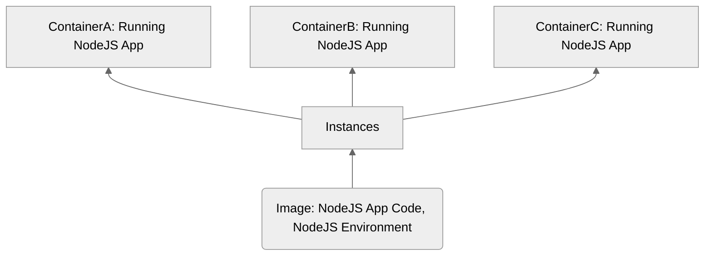
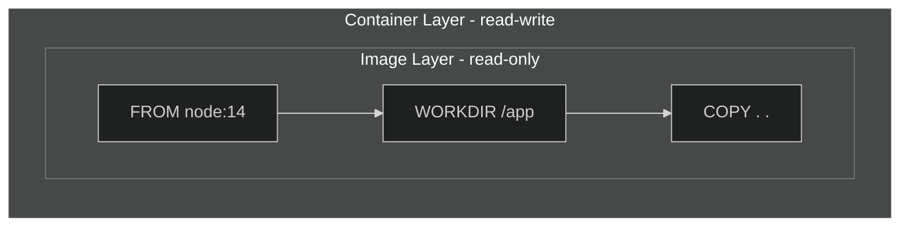
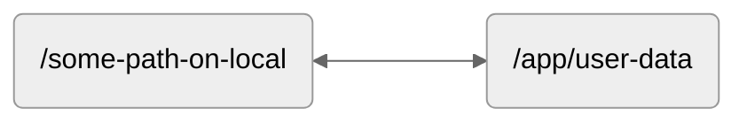

# Docker-Complete

- [Images & Containers](#images--containers)
  - [Building an Image](#building-an-image)
  - [Managing Container & Images](#managing-container--images)
    - [Running](#running-an-image)
    - [Why detach mode?](#why-detach-mode)
    - [Deleting](#deleting-container--image)
  - [Sharing Image](#sharing-image)
- [Data & Volumes](#data--volumes)
  - [Volumes to persist data](#volumes-to-persist-data)
  - [Anonymous & Named Volume](#anonymous--named-volume)
  - [Binding Volume](#binding-volume)
  - [Protect Volume](#protect-the-binding-volume-with-read-only)
  - [Nodemon watch](#nodejs-specific-nodemon)
  - [Volume summarize](#volume-summarize)
- [Environment file](#runtime-environment-file)
- [Argument](#build-time-arg)
- [Networking](#networking)

---

## Images & Containers

- Image: Blueprint for a container, setup and instructions..
- Container: The running "unit of software"
- One Image, multiple container instances..
- Containers are independent instances of an Image



- Use [prebuilt Image](https://hub.docker.com/_/node)
- Running prebuilt Node Image `docker run -it node` `it` flag is interactive mode to pull into running container of this instance
- Show all containers `docker ps -a`
- A Container has it's own environment, and need an exposed port to communicate

---

### Building an Image

- Image is a layer based architecture and is read-only.
- Once an Image has been built it's isolated, which means any changes to source code will have no effect to the built Image.
- Every instruction creates an layer, that will be cached. This can help with building performance, i.e. skip running `npm i` everytime we are building when we did not made any dependency changes.
- To summarize, Dockerfile contains instructions (layers) to build an Image, once built it cannot be changed, read-only. Containers are wrapper layer around the Image, and contains the instructions to run the application - read-write.
- `docker build -t feedback-node:volumes .` Build an image name feedback-node and tag it



---

### Managing Container & Images

#### Running an Image

- Run an image with `docker run` will create a new instance
- Resume / Stop the instance with `docker start` / `docker stop`
- By default container is in attached mode, this means CLI is listening to the container. We can detach it with `-d` flag `docker run -p 3000:80 -d imageId`. To attach again `docker attach imageId`.
- Run with auto cleanup `docker run -p 3000:80 -d --rm imageId` will remove the container after stopping.

#### Why detach mode?

- Sometimes we to interact with the terminal, thus we can use another flag `-it` that is interactive terminal, even without detaching.
- `docker run -it imageId` spins up a container with interactive terminal while listening to the container.

#### Deleting container & image

- Container has to be removed before deleting the image.
- To stop running container `docker stop containerId` Add multiple containers with space between.
- To delete, `docker rm containerId`, add multiple containers to delete. To delete all `docker container prune`
- To delete images, list all images `docker images`, then `delete rmi imageId`. To remove all images `docker image prune -a`

#### Naming & Tag

- Tag is essentially versioning of an Image.
- To adopt a name when running `docker run --name my-app imageId`
- To rename this container instance `docker rename my-app my-new-app`
- Name and tag is important when publishing an Image.
- This can be done with when building`docker build -t my-app:latest .`

---

### Sharing Image

- Image may be shared prebuilt or Dockerfile with source code.
- Create a repository on DockerHub i.e. **testing-repo**, then rename the Image with the repo name and add a new tag.
- I.e. **docker tag pyrnd:latest aixufey/testing-repo:latest** where pyrnd:latest is the target name:tag -> repo dir aixufey/reponame:tag
- Push to DockerHub `docker push aixufey/testing-repo:latest`, needs to be logged in.
- **Always pull before run to get the latest version, docker will not fetch automatically**
- Pull to local `docker pull aixufey/testing-repo:latest`, if repo is public anyone can pull.
- Run `docker run -it --rm aixufey/testing-repo:latest`, run as normal with flags.

---

## Data & Volumes

- Data in an Image is code and environment.
- Data in a Container is temporary application data, stored in memory or temp files. This is the core idea of container which basically is just a read-write layer wrapping the Image. When container is killed, data is lost, even if spinning up a new container with the same image.
- Data in Volume are persistent data, like Database. It means when container is shutdown, volume shall persist regardless.



### Volumes to persist data

#### Anonymous & Named Volume

- Volumes are folder path on local that can mount into containers.
- This essentially means host can access environment files and vice versa.
- Volumes need a name to persist `-v feedback:/app/feedback` will create a named Volume feedback in /app/feedback when running the image. This will persist even if container and image are removed.
- This flag creates a named volume, however anonymous volume may be created as instruction in Dockerfile using `VOLUME ["volume-name"]`. But it will be recreated everytime a container spins up.

#### Binding Volume

- Essentially Binding creates a "shared folder" between host and the container, any changes to this directory/file are reflected on both host and the container. **The directory has to be absolute path mapped to the container along with an anonymous Volume to preserve node_modules being overwritten from host machine** This will cause error as host machine most likely won't have those node modules installed.

- `docker run -p 3000:80 -d --rm --name feedback-app -v feedback:/app/feedback -v "C:\Users\userName\Desktop\Docker-Complete\src\DataVolume:/app" -v /app/node_modules feedback-node:volumes`

- The first -v creates a named Volume feedback, second -v creates a binding between host folder source mapped to container /app,
finally the third -v creates an anonymous Volume to preserve node_modules.

#### Protect the binding volume with Read-Only

- We can add `:ro` to make host folder read-only. But we want read-write to specific folder i.e. `temp` folder. Just add an anonymous volume to `temp` folder.
- `docker run -p 3000:80 -d --rm --name feedback-app -v feedback:/app/feedback -v "C:\Users\userName\Desktop\Docker-Complete\src\DataVolume:/app:ro" -v /app/node_modules -v /app/temp feedback-node:volumes`

#### NodeJS specific Nodemon

- Nodemon is a dev tool to auto restart node when file changes in directory are detected.
- In Dockerfile `CMD ["npm", "start"]`
- In `package.json` we can add these: On windows using `-L` for legacy watch mode is necessarily.
- For better performance on Windows using WSL2 Linux distro, see attached PDF.

```json
"scripts": {
    "start": "nodemon -L server.js"
  },
  "devDependencies": {
    "nodemon": "^2.0.4"
  }
```

#### Volume summarize

|_Volume Type_|_Description_|
|:-:|:-:|
|_Anonymous_|_A volume that is not named and is created when a container is started. The volume is deleted when the container is stopped._|
|_Named_|_A volume that is named and is created when a container is started. The volume is not deleted when the container is stopped._|
|_Binding_|_A binding is a way to mount a volume from the host machine into a container. The volume is not deleted when the container is stopped._|

- Anonymous & Named are managed by Docker
- Binding is managed by host

---

### Runtime Environment file

- Secret keys and private files can be stored in environment file.

- Environment file can be created  with `.env` and set a port to default `PORT=80`

- When running an image we can dynamic adjust the port using this file.

- To run with env file, `docker run -p 3000:80 --env-file ./.env` or `docker run -p 3000:80 -e PORT=80`

### Build time ARG

- Using `ARG DEFAULT_PORT=80` in Dockerfile we can pass port at building time

- `docker build -t feedback-node:arg --build-arg DEFAULT_PORT=1234 .` We can pass port `1234` at build time

- If the ARG is used, the image port is set to `1234` at build time so we have to expose the port to `1234` when running `docker run -p 3000:1234`

---

### Networking

- By default container can communicate with web API's. With that said, container may expose a port to the host and have a web API open on an exposed port for **HTTP requests**.
- Container may fetch request from API, communicate with HOST machine or another Container.
