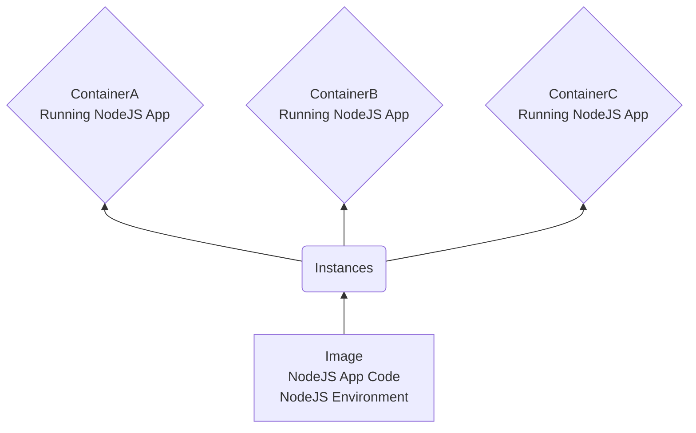

# Docker-Complete

## Images & Containers

- Image: Blueprint for a container, setup and instructions..
- Container: The running "unit of software"
- One Image, multiple container instances..

- Use [prebuilt Image](https://hub.docker.com/_/node)
- Running prebuilt Node Image `docker run -it node` `it` flag is interactive mode to pull into running container of this instance
- Show all containers `docker ps -a`
- A Container has it's own environment, and need an exposed port to communicate
