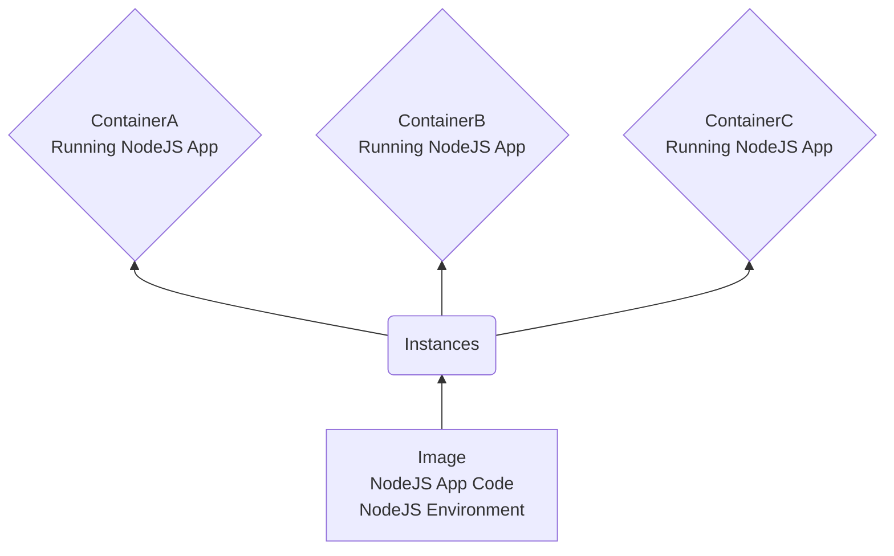

# Docker-Complete

## Images & Containers

- Image: Blueprint for a container, setup and instructions..
- Container: The running "unit of software"
- One Image, multiple container instances..
- Containers are independent instances of an Image

- Use [prebuilt Image](https://hub.docker.com/_/node)
- Running prebuilt Node Image `docker run -it node` `it` flag is interactive mode to pull into running container of this instance
- Show all containers `docker ps -a`
- A Container has it's own environment, and need an exposed port to communicate

---

### Building an Image

- Image is layer based architecture and is read-only.

- Once an Image has been built it's isolated, which means any changes to source code will have any effect to the built Image.

- Every instruction creates an layer, that will be cached. This can help with building performance, i.e. skip running `npm i` everytime we are building when we did not made any dependency changes.
