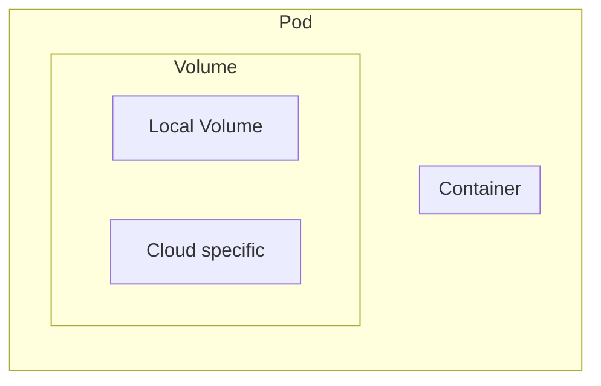

# Kubernetes managing Volume

- Kubernetes can mount Volumes into containers.
- Lifetime of Volumes is bound to the Pod itself.
- Volume depends on the Pod, but do support surival if Pod is removed.

## Volume types

- `emptyDir` creates a volume when Pod is assigned to a node, initially empty - deleted when Pod is removed.
  - All containers in the Pod can r-w in the emptyDir, survives container crashes.
