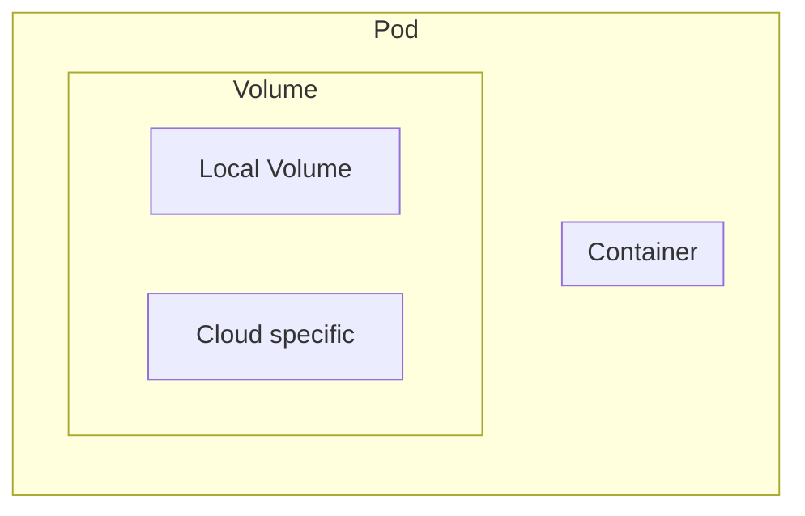
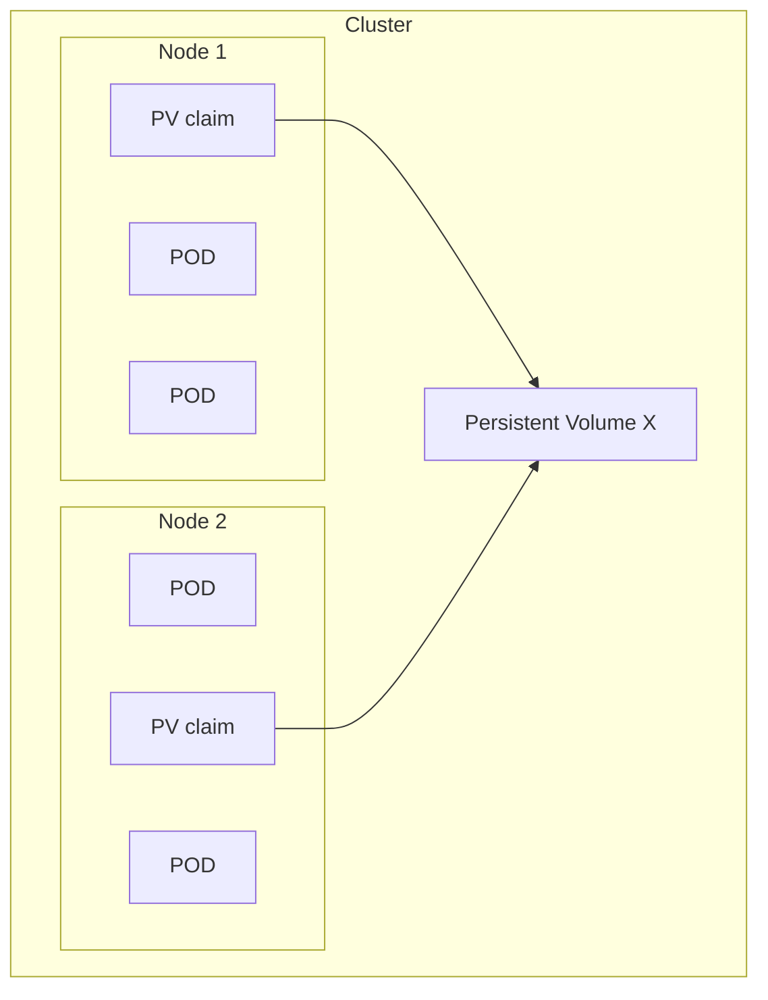

# Kubernetes managing Volume

- Kubernetes can mount Volumes into containers.
- Lifetime of Volumes is bound to the Pod itself.
- Volume depends on the Pod, but do support surival if Pod is removed.

## Volume types

- `emptyDir` creates a volume when Pod is assigned to a node, initially empty - deleted when Pod is removed.
  - All containers in the Pod can r-w in the emptyDir, survives container crashes.
  - Useful for 1 replica, if using more replicas the traffic will be redirected if container crashes and volume will also be unstable.

- `hostPath` creates a volume from host node's filesystem into your Pods.
  - Multiple containers shares the resource, if running more replicas and some crashes, the data is still available.

## Persistent Volumes

- Persistent Volumes are independent entities from Pod and Node that are configured to work with larger scale. Each Node use persistent volume claim to request access to these PV's.

