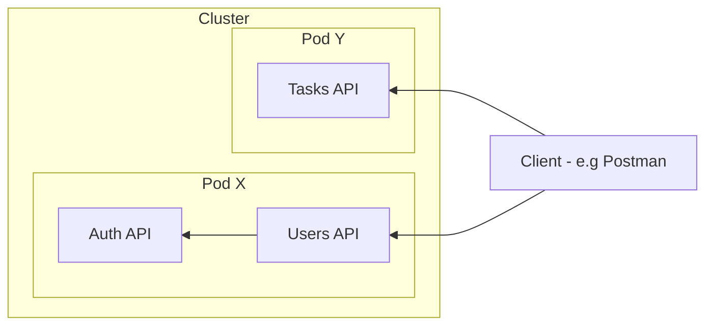

# Networking

```mermaid
    graph RL
    subgraph "Cluster"
    subgraph "Pod X"
    A[Auth API]
    B[Users API]
    B --> A
    end
    subgraph "Pod Y"
    C[Tasks API]
    end
    end
    X[Client - e.g Postman]
    X --> B
    X --> C
```
