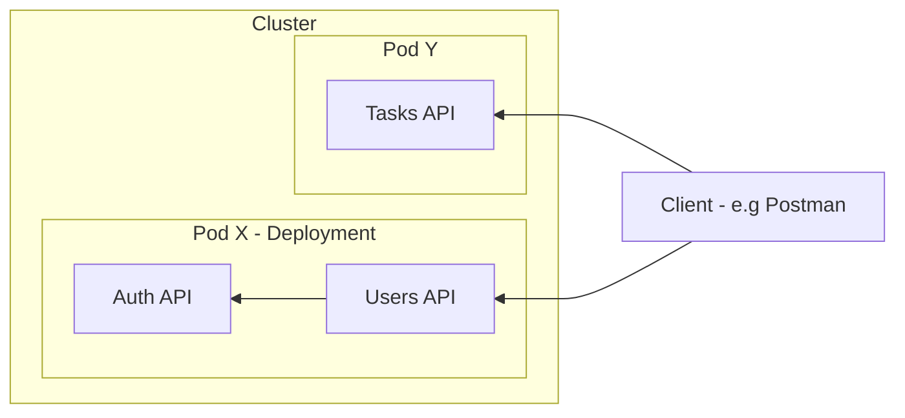
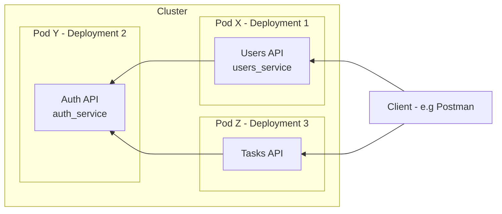

# Networking

> - Each `*.yml` file creates one kind of Pod, the replicas represents the running instances of this Pod, in this context `Pod X` may be a Deployment kind, but manages 2 different images/containers.
> - A `Deployment` kind, can create and manage multiple containers

- Pod X contains users container and auth container. Only the users container has port exposed to outside the Pod, auth container is only internal.
- For all internal address is `localhost` and target container port for communication.
- Users container listening on port `8080` we can make request via Client. The communication between Pod/Container and external is supported by Service - LoadBalancer.

---

## Multiple Deployments

> - The auth container should not be public facing at all, but should be available cluster internal to Users and Tasks.
> - We can create separate deployments, the gist is each Pod represents own network, therefore localhost is only within the Pod, for Pod-Pod we use ClusterIP.

- For Pod-Pod comm. we can use Service with ClusterIP and utilize generated environment var by Kubernetes, using this template with suffix, all caps with underscore e.g: `AUTH_SERVICE_SERVICE_HOST` The prefix is metadata name of the service and the suffix is a constant.
- We could also manually retrieve the assigned IP after applying Service using `kubectl get services`

### k8s DNS

- For even simpler solution we could just use the service name and bind to a namespace, inside deployment.yml we could write `"auth_service.default"` where `default` is the default namespace, check more namespace `kubectl get namespace`

### Summary

In most cases we don't want to have multiple containers per Pods.
So in a multiple container context, we are working with 3 Pods, Users - Auth - Task. Not all Pod should be exposed to public, therefore Deployment & separate Service has to be configured accordingy.
