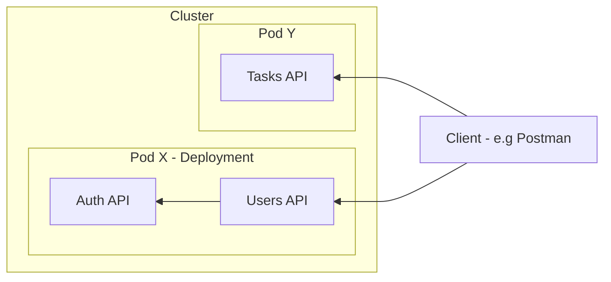

# Networking

> - Each `*.yml` file creates one kind of Pod, the replicas represents the running instances of this Pod, in this context `Pod X` may be a Deployment kind, but manages 2 different images/containers.
> - A `Deployment` kind, can create and manage multiple containers

- Pod X contains users container and auth container. Only the users container has port exposed to outside the Pod, auth container is only internal.
- For all internal address is `localhost` and target container port for communication.
- Users container listening on port `8080` we can make request via Client. The communication between Pod/Container and external is supported by Service - LoadBalancer.
