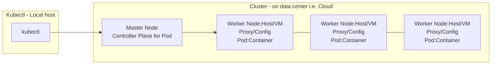

# Kubernetes

- Kubernetes is like docker-compose for multiple machines where we run our app. Every Worker Node represents a host/vm instance that contains Pod(container) + Proxy/Config (server) and a Master Node who manage these workers. This forms a Cluster. This Master Node can replicate Cloud provider API such as AWS, Azure etc.. for platform specific setup to run containers on them.

## Concept

- You still need to create the Cluster that has the Master Node/Controller and Worker Nodes that contains pod + Proxy.
- Kubernetes **will** orchestrate **DEPLOYED** images from a registry i.e. `DockerHub`, to run the `Pod` - containers, monitor pods and scale the pods accordingly. That being said, you still need the image for building the app logic.
- Kubernetes **will NOT** create this infrastructure for us.

- **Master Node**: `API` for kubelets, `Scheduler` watcher for Pods, `Kube-Controller-Manager` and `Cloud-Controller-manager` for interacting with Cloud Providers
- **Worker Node**: Consist of all the tools for running a container/containers. Docker is required, and `kubelet`, the connection for Master Node to Worker Nodes. `Kube-proxy`, managing incoming & outcoming Pod network.

## Architecture - How Kubernetes Manage Pods

- Kubernetes works with Objects - Pods, Deployments, Services, Volume
  - **Pod**: Run one or multiple containers. A pod is just a wrapper for container that is managed by Kubernetes.
  - **Deployment**: This key object is where we define numbers of pods and containers it should create and manage for you. Kubernetes will place pods on worker nodes - creating these pods - starting the containers. We don't have to manually pick remote hosts
    - can start, stop and rollback
    - Dynamic scaling for pods, i.e. high inc. traffic = creating more instances of pods, less traffic = remove unnecessary pods.
- We don't create pods, but deployment object as instructions so Kubernetes will manage this for us.

---

## Tools

- Kubectl - CLI tool for cluster instructions, i.e. new deployment, pod state etc.
  - Cluster is the infrastructure
  - Kubectl is the tool for managing this infrastructure
  - Master Node applies instructions to pods.
- Minikube - Setting up a dummy Cluster on local machine inside a VM to simulate another machine for testing application.

## Example of workflow

1. Build the Image `docker build -t kub-example .`
2. Create the repo in Dockerhub, retag with repo e.g `docker tag kub-example sparrow/kub-example` and push to repo `docker push sparrow/kub-example`
3. Then use kubectl to create the `Deployment` object `kubectl create deployment first-kub-app --image=sparrow/kub-example`.
    - Check deployment status `kubectl get deployment`
    - Check pods status `kubectl get pods`
4. Get the dashboard `minikube dashboard` for the cluster meta.

---

## Install

## [Kubectl]("https://kubernetes.io/docs/tasks/tools/install-kubectl-windows/") Controller with cmd for cluster instructions

- Installation using [Chocolatey]("https://kubernetes.io/docs/tasks/tools/install-kubectl-windows/#install-nonstandard-package-tools")

## [Minikube]("https://minikube.sigs.k8s.io/docs/start/") for testing Cluster on Host

- Creates a dummy cluster in VM on localhost for testing.
- This cluster contains Master Node and Worker Nodes.
- Installation with [Docker]("https://minikube.sigs.k8s.io/docs/drivers/docker/") as driver
- Then run `minikube start --driver=docker`, check the cluster with `minikube status`. Once this Cluster is up, we can use kubectl to communicate with this dummy cluster.
- Bring up the dashboard `minikube dashboard` to see the running cluster.

---
