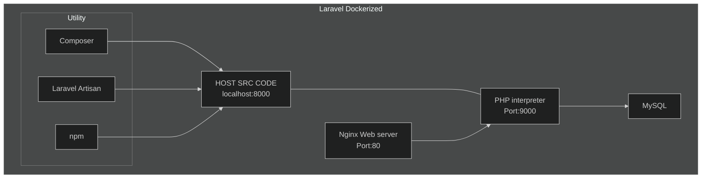

# Laravel Dockerized

- Host contains Laravel PHP src, exposed for PHP to interpret our Laravel code to generate response for request. The web server takes the incoming HTTP request, and passes them to PHP interpreter, and then sends the responses back to the client.
- Nginx forward requests for PHP files to a FASTCGI server listening on port `9000` of a service PHP. PHP will interpret and return the response back to Nginx, which then sends the response to the client.

## Utilities

- **Composer** is PHP's "npm". I.e. creating Laravel app using Composer.
- **Laravel Artisan** Laravel tool for db migrations.
- **npm** Laravel use npm for some front end logic.

## Installing

- Running single service from docker-compose to install the app using `Composer` container with `docker-compose run --rm composer create-project --prefer-dist laravel/laravel .`. The `composer` is the name of the service, and `.` refers to container dir `"./src:/var/www/html"` which will be mirrored into host `./src` after installation.

## Running

- Running the app (server, php, mysql) `docker-compose up -d server php mysql`
- Tweaking the run, in compose for server we can add `depends_on` php, mysql, and then run `docker-compose up -d --build server`. This force docker-compose to check for latest change and just spin up server that will invoke php + mysql.
