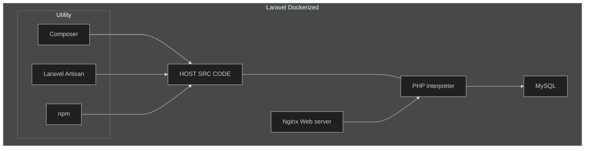

# Laravel Dockerized

- Host contains Laravel PHP src, exposed for PHP to interpret our Laravel code to generate response for request. The web server takes the incoming HTTP request, and passes them to PHP interpreter, and then sends the responses back to the client.

## Utilities

- **Composer** is PHP's "npm". I.e. creating Laravel app using Composer.
- **Laravel Artisan** Laravel tool for db migrations.
- **npm** Laravel use npm for some front end logic.
