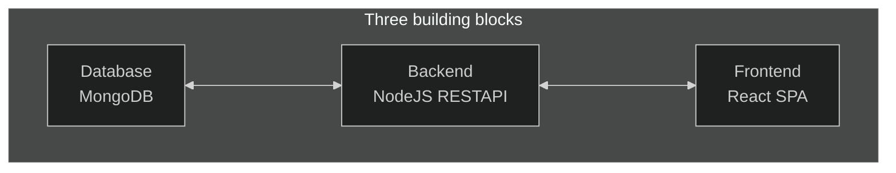

# Working with multiple application

## Frontend

> Basic React app making CRUD operations using endpoints from containerized backend running mongodb.

- Making a Dockerfile to containerize React app
- React is served in browser so the domain is localhost
- Build the React `docker build -t goals-react .`
- Run React `docker run --name goals-frontend --rm -it -p 3000:3000 goals-react`

---

## Backend

> Backend with express as REST API that communicates with another container mongoDB. The networking is container <---> container, where the backend domain is `mongodb://mongodb:27017/...`

- Build Backend `docker build -t goals-node .`
- Run Backend RESTAPI `docker run --name goals-backend --rm -d --network goals-net -p 80:80 goals-node`

- Mongodb and backend are on the same network, but how can frontend communicate with backend if not on the same network? We exposed port 80 for HTTP inside backend image

## Mongo

- Mongodb's default port is `27017`
- Initiate the db with named volume to persist data.
- Install mongodb image on the same container network `docker run --name mongodb -v data:/data/db --rm -d --network goals-net mongo`

- To run with authentication: `docker run --name mongodb -e MONGO_INITDB_ROOT_USERNAME=sparrow -e MONGO_INITDB_ROOT_PASSWORD=123123 -v data:/data/db --rm -d --network goals-net mongo` The root user is `sparrow` and pass `123123` is already configured in backend when we connected to mongodb

