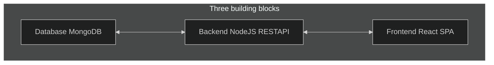

# Working with multiple application

## Frontend

> Basic React app making CRUD operations using endpoints from containerized backend running mongodb.

- Making a Dockerfile to containerize React app
- React is served in browser so the domain is localhost
- Build the React `docker build -t goals-react .`
- Run React `docker run --name goals-frontend --rm -it -p 3000:3000 goals-react`

---

## Backend

> Backend with express as REST API that communicates with another container mongoDB. The networking is container <---> container, where the backend domain is `mongodb://mongodb:27017/...`

- Build Backend `docker build -t goals-node .`
- Run Backend RESTAPI `docker run --name goals-backend --rm -d --network goals-net -p 80:80 goals-node`

- Mongodb and backend are on the same network, but how can frontend communicate with backend if not on the same network? We exposed port 80 for HTTP inside backend image

- Persisting data on Backend `docker run --name goals-backend -v logs:/app/logs -v "C:\Users\sparrow\Desktop\Docker-Complete\src\MultipleContainers\backend:/app" -v /app/node_modules --rm -d --network goals-net -p 80:80 goals-node`

    1. `-v logs:/app/logs`: This creates a Docker volume named logs on your host machine and mounts it to the /app/logs directory in your Docker container. Any files written to /app/logs inside the container will be stored in the logs volume on the host. This is typically done for log files that you want to persist and access even if the container is removed.
    2. `-v "C:\Users\sparrow\Desktop\Docker-Complete\src\MultipleContainers\backend:/app":` This mounts the local directory C:\Users\sparrow\Desktop\Docker-Complete\src\MultipleContainers\backend from your host machine to the /app directory in the Docker container. This is typically done during development so that changes to the local files are immediately reflected in the container.
    Remember to add `-L` flag in package.json when starting the nodemon script for legacy watch if not developing in Linux environment or using WSL2.
    3. `-v /app/node_modules`: This is an anonymous volume for the /app/node_modules directory. The purpose of this volume is to prevent the node_modules directory from your host machine (from the previous volume mount) from overwriting the node_modules directory inside the Docker container. This is important because the dependencies in node_modules might be compiled differently for your host machine and the Docker container, and you don't want the host's version to overwrite the container's version.

## Mongo

- Mongodb's default port is `27017`
- Initiate the db with named volume to persist data.
- Install mongodb image on the same container network `docker run --name mongodb -v data:/data/db --rm -d --network goals-net mongo`

- To run with authentication: `docker run --name mongodb -e MONGO_INITDB_ROOT_USERNAME=sparrow -e MONGO_INITDB_ROOT_PASSWORD=123123 -v data:/data/db --rm -d --network goals-net mongo` The root user is `sparrow` and pass `123123` is already configured in backend when we connected to mongodb

