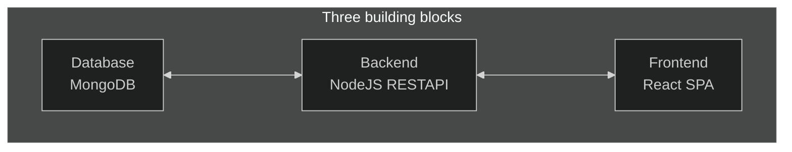

# Working with multiple application

## Frontend

> Basic React app making CRUD operations using endpoints from containerized backend running mongodb.

- Making a Dockerfile to containerize React app

---

## Backend

> Backend with express running a mongodb that has CRUD endpoints. The networking is container-container, where the backend domain is `mongodb://localhost:27017/...`

- Mongodb's default port is `27017`
- Install mongodb image `docker run --name mongodb --rm -d -p 27017:27017 mongo`

